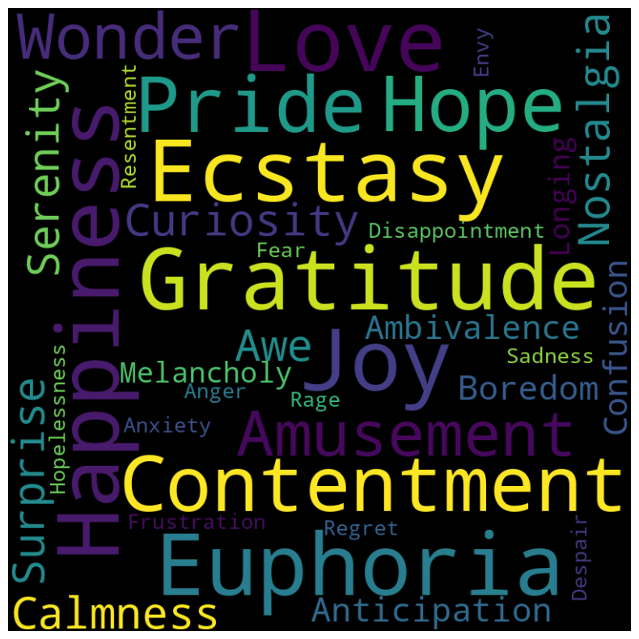
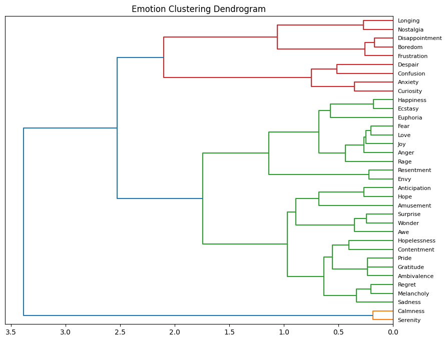
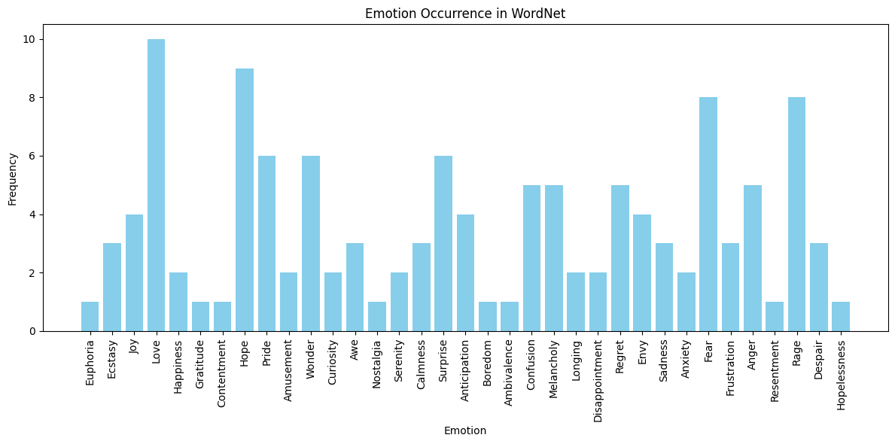
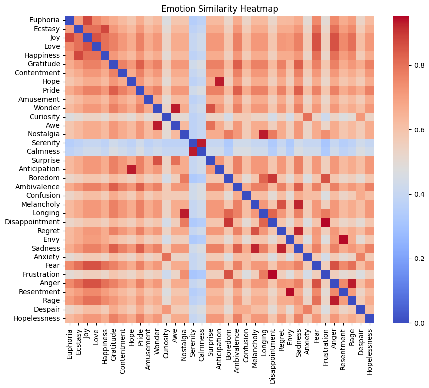

# Emotional-spectrum
Analysis of the human emotional spectrum

A project designed to explore and analyze a list of emotions using various techniques including word clouds, descriptive analysis, clustering, and visualization. This project aims to provide insights into the rich landscape of human emotions, their descriptions, occurrences, and relationships.

The project consists of several Python scripts, each serving a specific purpose:

1. `emotions_wordcloud.py`: Generates a word cloud visualizing the list of emotions.

2. `emotions_descriptions.py`: Provides descriptions for each emotion and allows exploration of emotions interactively.
3. `emotions_clustering.py`: Performs K-Means clustering on the emotions and visualizes the results using a dendrogram.

4. `emotions_occurrence.py`: Counts the occurrence of each emotion in WordNet and creates a bar chart.

5. `emotions_similarity_heatmap.py`: Calculates the semantic similarity between emotions and creates a heatmap to visualize the similarity matrix.

To run any of these scripts, simply execute them using Python from the command line or your preferred IDE.

The Human emotionals which we covered in the spectrum, in order from intense positive to neutral to intense negative emotions, are as follows:
 
1. Euphoria
2. Ecstasy
3. Joy
4. Love
5. Happiness
6. Gratitude
7. Contentment
8. Hope
9. Pride
10. Amusement
11. Wonder
12. Curiosity
13. Awe
14. Nostalgia
15. Serenity
16. Calmness
17. Surprise
18. Anticipation
19. Boredom
20. Ambivalence
21. Confusion
22. Melancholy
23. Longing
24. Disappointment
25. Regret
26. Envy
27. Sadness
28. Anxiety
29. Fear
30. Frustration
31. Anger
32. Resentment
33. Rage
34. Despair
35. Hopelessness

## Description 
The project begins with the generation of a word cloud representing the list of emotions. Each emotion is visualized with a font size proportional to its importance or frequency in the list.

## Exploration 
The `emotions_descriptions.py` script allows users to explore emotions interactively. Users can choose to explore a random emotion and receive a description of that emotion. This interactive exploration provides insights into the diverse range of human emotions and their nuanced meanings.

## Analysis 
The project further delves into the analysis of emotions through clustering and visualization. The `emotions_clustering.py` script performs K-Means clustering on the semantic similarity matrix of emotions and visualizes the clustering results using a dendrogram. Additionally, the `emotions_similarity_heatmap.py` script creates a heatmap to visualize the semantic similarity between emotions, providing a comprehensive understanding of their relationships.
